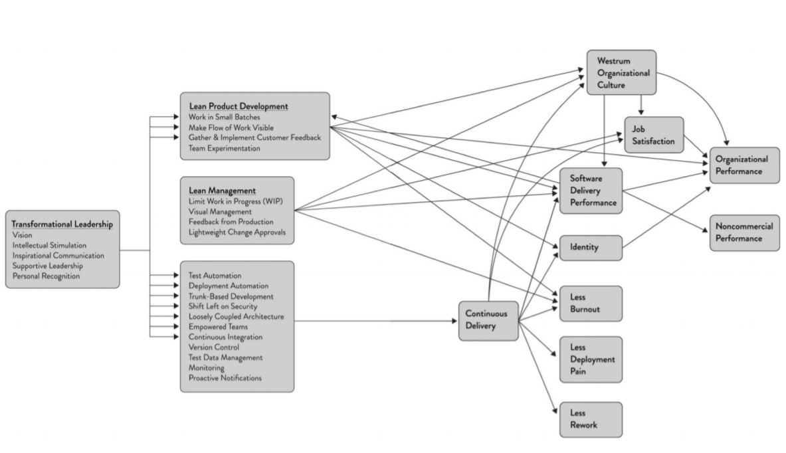

# Learnings from "ACCELERATE: Building and Scaling High Performance Technical Organizations"

#### Key Takeaway :
"If you cannot measure it, you cannot improve it" & "You can't manage, what you can't measure"- was Peter Drucker's famous quote. This was the biggest takeaway for me, from reading the book. The book is a wonderful read. It throws the point - right out, stating - if something needs to be improved, it needs to be measured. The parameters to be measured are the "Capabilities" ( of an Organization/Team) that will lead to improvement in the "Performance"(as an organization delivering a product).

#### Capabilities required to Accelerate Performance :

Capabilities ……………………………………………………………………………………………………………/………………………Expected Outcomes……………..……………/…..Organizational Performance

The above set of capabilities are a combination of Technical, Process and Cultural aspects that needs to be addressed, in order to improve an Organizations' performance. The process of making the change begins by setting up practices, which becomes habits, fostering culture; leading to efficient delivery and thereby an improved organizational performance.

                              Technical Practices / Process          >         Culture        >             Delivery             >            Organizational Performance

All of the above can be achieved, only when the top management also believes and wants to live by the same principles. The backing of the management is of utmost importance, in order to be able to achieve organizational performance. The possible hurdles/ opportunities to improve are from the mistakes arising out of experimentation and trial/error. Such mistakes needs to be treated as stepping stones, and response time the teams improve upon, in order to restore the application to normalcy; should become a factor to consider. Retrospectives should be driven to factor improvement and not towards finding who committed the mistake.

#### Capabilities:

Transformational Leadership - is about the expectation from the management. The capabilities required are self-explanatory - Vision, Intellectual Stimulation ( triggers thinking / alternate ways to solve a problem from the team ), Inspirational Communication, Supportive Leadership and Personal Recognition. These measures can be measured by a survey. The questions also explain the expectation from the management.

Survey questions in appendix below.

#### Lean Product Development:

	A. Work in small batches.
	B. Make flow of work visible - The changes should reach production and should be used by customers.
	C. Gather and implement customer feedback
	D. Team Experimentation

The minimal "work in progress" and near zero inventory is the philosophy. The changing market requirements cannot be adopted into a product, if there is a long development cycle. The requirements should be broken down to simplify to the minimal requirement and the same has to be churned out to the market. The feedback will then help us understand, if we are thinking in the right direction. This will reduce a lot of rework, specially in knowledge based industries such as IT. Experimentation to achieve the desired outcome and embracing the possibility of failure, while making sure not to repeat the same mistakes again is the core to successful products/services.

In brief, an ideal scenario is to put out the developed features to be available for consumption every two or three weeks. In practical scenario, break it down and make the possible features that can be consumed, to be available; while the rest is baked in with the feature toggles till it can be made consumable.

#### Lean Management:

	A. Limit the Work in Progress
	B. Visual Management
	C. Feedback from Production
	D. Lightweight change approval process.

As Management - the main idea behind limiting the work in progress - is to be able to be sure that the teams are not overburdened ( which lead to longer lead times ) and to bring up the obstacles to flow ( flow here refers to the output of the work done ). The obstacles come to the foray with the feedback from the production systems and the metrics that are being monitored.   When the obstacles surface, they need to result in process improvement and thereby throughput of the product/service.

Lightweight change approval will reduce the time to get the change to production and being burdened with approval processes. Peer reviews and team reviews, which make the team responsible for the changes should be applied, than a central team - which governs the changes. The central team approach for governance leads to a lot of bottleneck and is very difficult for one team to understand and approve all changes.

In short, when all the four capabilities above work in tandem, the improvement in the output is evident.

Measures here are:
a. Number of process improvements implemented.
b. Improvement in throughput.
c. Number of changes delivered after peer/team reviews.
d. Number of issues/bugs for new features delivered.
e. Time to address the bug, in production.

#### Continuous Delivery:

	A. Empowered teams are the result of management trust and vision towards a great product.
	B. Loosely Coupled Architecture is the means of having different feature teams interact functionally via contracts and having minimal dependency on each other, with respect to implementing any changes within the service.
	C. Version Control - which is the first step and is addressed using any of the version control systems such as git, GitHub etc is a must.
	D. Trunk Based Development - Reduces long running branches, hence lesser merge conflicts.
	E. Continuous Integration
	F. Deployment Automation
	G. Shift Left on Security
	H. Test Data Management
	I. Test Automation
	J. Monitoring
	K. Proactive Notifications

Continuous Delivery is the core aspect that solves the problem of long lead times and delayed delivery of the product to the market. To achieve the faster time to market, the above capabilities needs to be adopted by the teams in the order above. The points A to F - are a must needs to be the first priority. The points G-I - are a process of evolution, that needs to be taken care with every code merge. Points J-K - needs to be set up and evolved based on the feedback received and those not detected by the existing monitoring and notification methods.

#### Results

The resultant of the above capabilities are:
	A. Westrum Organizational Culture - Generative Model ( https://www.agileconnection.com/article/you-re-ready-devops-your-workplace )
	B. Job Satisfaction
	C. Improved Software Delivery Performance
	D. Identity
	E. Lesser Burnout
	F. Less Deployment Pain
	G. Less Rework.

All of the above parameters are inbound measures to measure the organizational success. The success of an organization is driven predominantly by the success of the product/service in the market and the inbound measures, help in understanding the reflection by the market towards the product/service.

Dimensions on which the success/failure of a product/service, can be measured:

	A. Organizational Performance

	i. Profitability
	ii. Market Share
	iii. Productivity

	B. Non-Commercial Performance

	i. Quantity of product feature/services.
	ii. Operating Efficiency
	iii. Customer Satisfaction
	iv. Quality of product features/ services.
	v. Achieved organization mission or goals.

#### Appendix:

Survey to Measure Transformational Leadership:

Westrum Organizational Culture Models:

Survey to measure the Culture:

Strongly Agree :: Generative Organizational Culture  
Strongly Disagree:: Pathological Organizational Culture.
